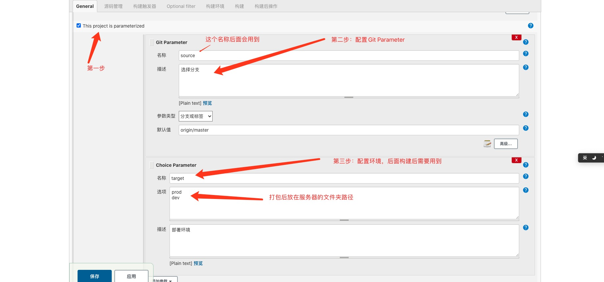
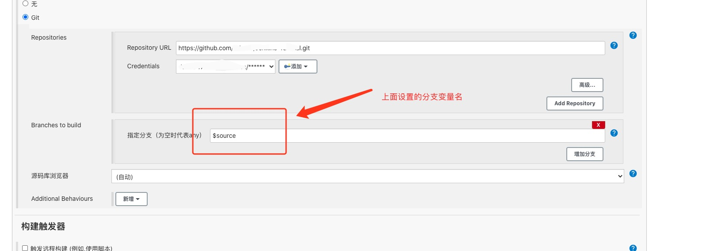
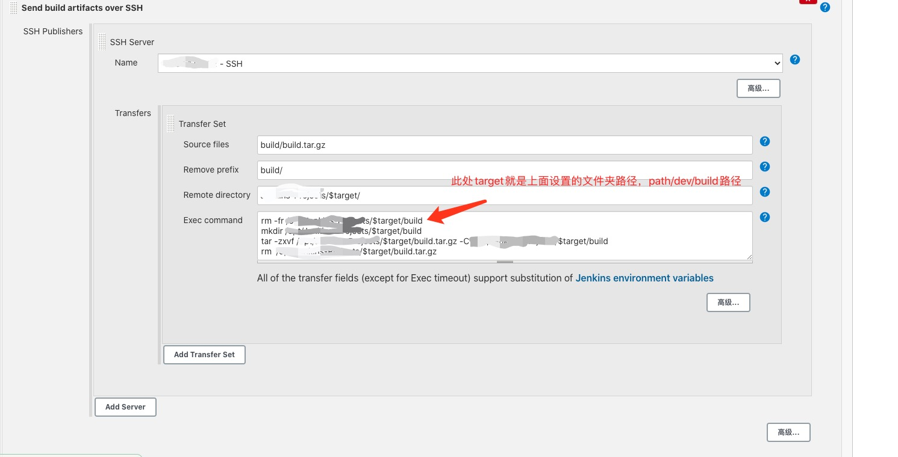
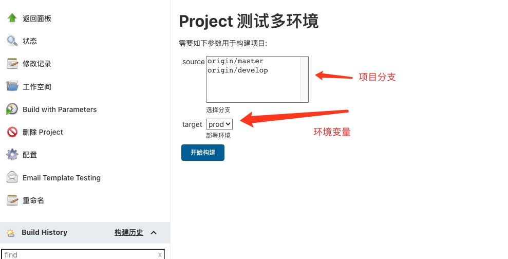

### 前沿
前一章说到如何使用[Jenkins实现自动部署项目](./Jenkins自动部署项目.md)，本章继续讲在Jenkins中如何实现不同环境对应不同分支打包部署。

### 配置项目
多环境部署实际是通过选择不同target去拉取分支的代码库，最重要是`Git Parameter`和`Choice Parameter`配置，(如果没找到`Git Parameter`设置项，可以去<strong>插件管理</strong> => <strong>选择下载Git Parameter</strong>插件)如图：

然后指定对应的分支

最后将压缩包解压到对应环境的路径下

设置OK后页面如下：

