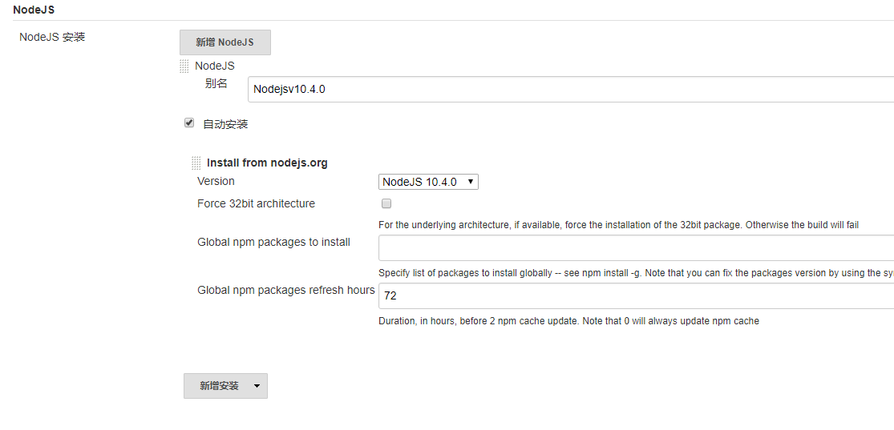

[引用](https://cdflove9426.github.io/deploy/jenkins_cicl.html#jenkins)

## 安装 java 环境

jenkins 运行在 java 环境下

[ubuntu 17.x/CentOS 7.x 中安装 JAVA JDK](https://blog.csdn.net/fenglailea/article/details/26006647)

```sh
$ sudo add-apt-repository ppa:openjdk-r/ppa
$ sudo apt-get update
$ sudo apt-get install openjdk-8-jdk
```

## 安装 jenkins

```sh
wget -q -O - http://pkg.jenkins-ci.org/debian/jenkins-ci.org.key | sudo apt-key add -
sudo sh -c 'echo deb http://pkg.jenkins-ci.org/debian binary/ > /etc/apt/sources.list.d/jenkins.list'
sudo apt-get update
sudo apt-get install jenkins
```

安装文件位置

安装目录：`/var/lib/jenkins`

日志目录：`/var/log/jenkins/jenkins.log`

启动/停止

`sudo /etc/init.d/jenkins start`

`sudo /etc/init.d/jenkins stop`

<strong>访问（当前 IP）</strong> http://192.168.1.100:8080/ 阿里云服务器话记得开启网络安全组

- 以守护进程启动 Jenkins，详细信息可以参考 /etc/init.d/jenkins
- 创建一个 jenkins 用户用以启动服务
- 如果 Jenkins 服务异常，可以查看 /var/log/jenkins/jenkins.log 日志文件
- 配置文件为 /etc/default/jenkins，可以配置启动参数，比如 JENKINS_HOME
- Jenkins 启动端口为 8080，使用浏览器访问该端口开始配置项目<strong>如果 /etc/init.d/jenkins 文件启动 Jenkins 服务失败，编辑 /etc/default/jenkins 文件，把 HTTP_PORT=8080 换成你的主机可以使用的端口号即可</strong>
-

<strong>CentOS：修改配置在这</strong>`sudo vim /etc/sysconfig/jenkins`

<strong>windows 下</strong>： 从 Jenkins 官网下载最新 war 文件。 运行 java -jar jenkins.war 即可。

## Jenkins 初始化

1. jenkins 的默认端口是 8080,启动成功后在浏览器打开。
2. 进入后会让我们输管理员密码，打开网页上提示路径下的文件，复制密码粘贴输入即可。
3. 然后按照插件，默认推荐就可以。
4. 创建一个管理员账户。（记住账号）
   如果在 linux，复制默认的密码可是个麻烦事,可以通过 cat 命令输出

```sh
/var/lib/jenkins/secrets/initialAdminPassword
sudo cat /var/lib/jenkins/secrets/initialAdminPassword
```

可以输出查看创建任务 选择自由风格的软件项目，并起一个名字

## git 钩子功能

我们想要的效果是：

git 提交代码到 git 仓库时 jenkins 自动构建，自动部署。

钩子需要在远端仓库上进行配置。 Jenkins 服务器的接口地址，当本地向远端仓库发起 push 时，远端仓库会向配置的 Jenkins 服务器的接口地址发起一个带参数的请求，jenkins 收到后开始执行。

在 Jenkins 中选择项目， 配置=》代码管理

1. 输入 git 仓库地址。
2. git 账号名和密码
3. 选择分支！


<strong>安装 Generic Webhook Trigger 插件</strong> 在任务配置里勾选 Generic Webhook Trigger 即可。 触发器插件功能很强大，可以根据不同的触发参数触发不同的构建操作，比如我向远程仓库提交的是 master 分支的代码，就执行代码部署工作，我向远程仓库提交的是某个 feature 分支，就执行单元测试，单元测试通过后合并至 dev 分支。只要有提交就触发。

<strong>设置 webhooks</strong> 在 git 仓库中设置 webhooks github： url:http://<用户 id>:<api 对应 token>@<Jenkins IP 地址>:端口/generic-webhook-trigger/invoke

userid 和 api token 在 jenkins 的系统管理-管理用户 Jenkins IP 地址和端口是为部署 jenkins 服务器的 ip 地址，端口号默认为 8080。 密码为 jenkins 账号 userid 对应的密码


<strong>测试钩子</strong> 点击 test,就可以触发钩子。 jenkins 开始执行任务,如果没有配置任务，默认只会在你提交新代码后，将新代码拉取到 jenkins 服务器上（jenkins 的工作环境）。

## 实现自动化构建

前端的项目离不开 node 的环境，所以我们可以通过插件，然 jenkins 的工作环境自动构建好 node 环境，来执行我们的构建工作，如 webpack,gulp 等。 <strong>nvm wrapper</strong> 插件 安装了该插件后，可以在 <strong>jenkins 配置 =》构建环境=》勾选</strong>“Run the build in an NVM managed environment” 并输入指定的 node.js 版本 如 `v9.8.0`

```
WARNING

nvm wrapper不稳的！！影响构建。 改用 NodeJS Plug吧
```

安装后 进入 系统管理->Global Tool Configuration，配置 node 下载及安装



回到项目的配置中，找到【构建环境】，勾选 Provide Node & npm bin/ folder to PATH

<strong>构建</strong>中添加执行语句

```sh
npm install &&
npm run unit &&
rm -rf dist &&
npm run build
```

保存 ，基本配置完成。

以后向 git 仓库提交代码，jenkins 就会自动构建好项目。


Finished 状态的如果是

- SUCCESS（蓝色）则证明执行的任务都顺利进行。
- FAILURE（红色）则证明中间有重大错误导致任务失败。
- UNSTABLE（黄色）代表有虽然有些小问题，但不阻碍任务进行。
  如果上一步是 SUCCESS，点击项目的工作空间，将会发现多了 dist 和 node_modules 两个文件夹。

## 自动化部署

自动构建还不够 还需要自动部署啊

Jenkins 上装一个插件<strong>Publish Over SSH</strong>，我们将通过这个工具实现服务器部署功能。

在要部署代码的服务器上创建一个文件夹用于接收 Jenkins 传过来的代码. Jenkins 往服务器上部署代码必须登录服务器,有两种登录验证方式， 一种是 ssh 验证，一种是密码验证，

在 <strong>系统管理 - Publish over SSH</strong>

```sh
Passphrase：密码（key的密码，没设置就是空）
Path to key：key文件（私钥）的路径
Key：将私钥复制到这个框中(path to key和key写一个即可)

SSH Servers的配置：
SSH Server Name：标识的名字（随便你取什么）
Hostname：需要连接ssh的主机名或ip地址（建议ip）
Username：用户名
Remote Directory：远程目录（上面第二步建的testjenkins文件夹的路径）

高级配置：
点击 Use password authentication, or use a different key：勾选这个可以使用密码登录，**不想配ssh，也可以用密码登陆**
Passphrase / Password：密码登录模式的密码
Port：端口（默认22）
Timeout (ms)：超时时间（毫秒）默认300000
```

点击`Test Configuration`测试一下是否可以连接上，如果成功会返回 success，失败会返回报错信息。

<strong>关于用 SSH 连接</strong>

```
Username The user that will be used to connect to the host. This user will need the public key in their authorized_keys file on the remote host (if using public key authentication).
```

所以需要 Key 选项填写 jenkins 挂载的电脑的私钥。 同时修改修改服务器，在 authorized_keys 文件添加 public key

## 如果想把构建好的文件 打包在一起 ，然后再再后续的操作中进行解压，可以执行以下操作，然后再解压。

进入 `配置 =》 构建` 添加

```sh
......
......
cd dist&&
tar -zcvf dist.tar.gz *
```

注意，因为权限问题，我们只能在现在的工作空间进行操作，离开这个文件夹就没有权限了，所以这里就不会直接把所有操作都放在这里。

## 构建后操作

点击构建后操作，增加构建后操作步骤，选择`send build artificial over SSH`。

```sh
Name:选择配好的ssh服务器（系统设置的设置好的）
Source files ：写你要传输的文件路径
Remove prefix ：要去掉的前缀，不写远程服务器的目录结构将和Source files写的一致
Remote directory ：写你要部署在远程服务器的那个目录地址下，不写就是SSH Servers配置里默认远程目录,(在默认配置的基础上)
Exec command ：传输完了要执行的命令，我这里执行了解压缩和解压缩完成后删除压缩包2个命令  (默认路径是在用户根目录下)
```

Source files ：dist/dist.tar.gz Remove prefix ：dist/ Remote directory ： Exec command ：

```sh
cd testJenkins
tar -zxvf dist.tar.gz
rm -rf dist.tar.gz
```

## 构建后邮件发送

`系统管理->系统设置`

1. Jenkins Location 找到系统管理员邮件地址，输入发送邮件的邮箱地址
2. 在邮件通知中输入配置
   
   配置好了之后可以勾选“通过发送测试邮件测试配置”来测试配置是否成功
3. 需要更高级的邮件通知功能需要再安装一个 Jenkins 插件：`Email Extension Plugin`

- Default Recipients：输入需要发送邮件的接收人邮箱地址，使用英文“,”分割。
- Default Subject：邮件的主题名 $PROJECT_NAME - $BUILD_STATUS - Build # \$BUILD_NUMBER! （默认）
- Default Content

```html
<!DOCTYPE html>
<html>
  <head>
    <meta charset="UTF-8" />
    <title>${ENV, var="JOB_NAME"}-第${BUILD_NUMBER}次构建日志</title>
  </head>

  <body
    leftmargin="8"
    marginwidth="0"
    topmargin="8"
    marginheight="4"
    offset="0"
  >
    <table
      width="95%"
      cellpadding="0"
      cellspacing="0"
      style="font-size: 11pt; font-family: Tahoma, Arial, Helvetica, sans-serif"
    >
      <tr>
        <td>
          <br />
          <b><font color="#0B610B">构建信息</font></b>
          <hr size="2" width="100%" align="center" />
        </td>
      </tr>
      <tr>
        <td>
          <ul>
            <li>项目名称 ： ${PROJECT_NAME}</li>
            <li>构建编号 ： 第${BUILD_NUMBER}次构建</li>
            <li>SVN 版本： ${SVN_REVISION}</li>
            <li>触发原因： ${CAUSE}</li>
            <li>
              构建日志： <a href="${BUILD_URL}console">${BUILD_URL}console</a>
            </li>
            <li>构建 Url ： <a href="${BUILD_URL}">${BUILD_URL}</a></li>
            <li>工作目录 ： <a href="${PROJECT_URL}ws">${PROJECT_URL}ws</a></li>
            <li>项目 Url ： <a href="${PROJECT_URL}">${PROJECT_URL}</a></li>
          </ul>
        </td>
      </tr>
      <tr>
        <td>
          <b><font color="#0B610B">变更集</font></b>
          <hr size="2" width="100%" align="center" />
        </td>
      </tr>

      <tr>
        <td>
          ${JELLY_SCRIPT,template="html"}<br />
          <hr size="2" width="100%" align="center" />
        </td>
      </tr>
    </table>
    <h1>
      $PROJECT_NAME - Build # $BUILD_NUMBER - $BUILD_STATUS: Check console
      output at $BUILD_URL to view the results.
    </h1>
  </body>
</html>
```

4. 在需要发送邮件通知的项目里添加 Email 配置

[jenkins 构建后邮件发送](https://blog.csdn.net/songjiaping/article/details/51496977) 点击 `增加构建后操作步骤`，选择 `Editable Email Notification`

点击 `advanced Settings`，配置 Trigger,选择触发时机，

一般都选择默认的，但是要注意需要添加 `Triggers`，没有添加 Triggers 就不会发送通知邮件出来，这是一个触发条件。

主要添加的 Triggers 有三类：`Failure-Any`构建失败，`Success`构建成功，`Unstable (Test Failures)`构建不稳定 时触发发送邮件通知。

然后再选择的 Triggers 点击高级。

send to 就是指发送给什么人，默认发送给 Developers，也就是对这次构建有过修改动作的人，一般会选择 Recipient List，就是默认列表中添加的成员邮箱都会被发送通知邮件。

<strong>Recipient List</strong> 可以填写多个邮箱，用,分开。
